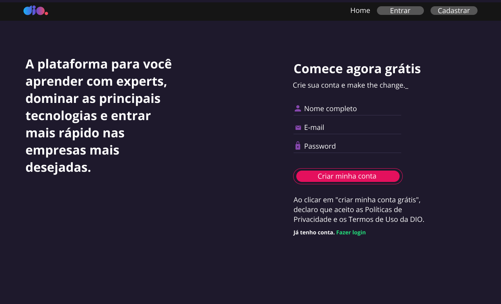

# cadastro-dio

> PT-BR
Tela de Cadastro da Plataforma Dio com React.
Projeto criado para o bootcam Orange tech, aqui recriamos a tela de cadastro da plataforma de ensino, DIO.
Foram utilizados neste projeto os seguintes conceitos: React CLI, Estilização com styled-components, Hooks e Formulários.
O projeto base é retirado deste modelo do figma:  <https://www.figma.com/file/fvjQQNtqaUdpuNixvCZVav/DIO-CLONE?node-id=0%3A1&t=Nq8Y64hoMFNIfcex-0>
> IN INGLISH
Dio Platform Registration Screen with React.
Project created for the Orange tech bootcam, here we recreate the registration screen of the teaching platform, DIO.
The following concepts were used in this project: React CLI, Styling with styled-components, Hooks and Forms.

